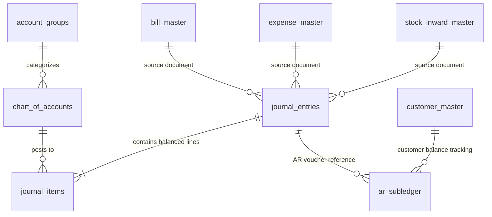

# Professional Double-Entry Accounting & Accounts Receivable (AR) System: Architecture & Migration Roadmap

## 1. Executive Summary & Architectural Reality Check

A standard ERP cannot rely on single-entry signed transaction records (e.g., storing income as positive and expense as negative in a single table). Professional accounting standards (GAAP/IFRS/Indian Accounting Standards) require a **Double-Entry General Ledger (GL)** and an **Accounts Receivable (AR) Sub-Ledger** where:

1. **Every business event creates balanced Debits and Credits** (`Debit = Credit` at the voucher level).
2. **Chart of Accounts (COA)** separates Assets, Liabilities, Equity, Revenue, and Expenses with unique account codes.
3. **Operational Records vs. Financial Ledger Separation**: Operational tables (`bill_master`, `stock_inward`, `expense_master`, `customer_advance`) record the business intent; the **Accounting Engine** translates them into immutable **Journal Entries** (`journal_entries` and `journal_items`).
4. **AR Sub-Ledger**: Tracks customer-level receivables, invoice-level settlement matching, credit limits, overdue aging (0-30, 31-60, 61-90, 90+ days), and outstanding balances.
5. **Zero Downtime / Non-Breaking Migration**: Existing operational flows (Billing, Advance, Credit Receipt, Expense, Stock Inward) continue uninterrupted while automatically posting to the ledger.

---

## 2. Core Accounting Data Model (Double-Entry Engine)



### 2.0. Account Type Master Table (`account_type_master`)
Immutable master table defining the 5 foundational account types (1 to 5) with database-level Foreign Key integrity constraints:

| Column | Type | Description |
| :--- | :--- | :--- |
| `id` | INT AUTO_INCREMENT | Internal Primary Key |
| `type_id` | INT NOT NULL UNIQUE | Master Type ID (`1` = ASSET, `2` = LIABILITY, `3` = EQUITY, `4` = REVENUE, `5` = EXPENSE) |
| `type_code` | VARCHAR(30) NOT NULL UNIQUE | Standard Type Code |
| `type_name` | VARCHAR(100) NOT NULL | Display Name (e.g., 'Assets', 'Liabilities') |
| `normal_balance` | ENUM('DEBIT', 'CREDIT') | Natural accounting balance |
| `display_order` | INT | UI sort order (1..5) |

### 2.1. Account Groups Master Table (`account_groups`) (Account Classification Hierarchy)
Defines primary account classifications:
* `ASSETS` (Normal Balance: Debit)
  * Current Assets (Cash in Hand, Bank Accounts, Accounts Receivable, Inventory)
  * Non-Current Assets (Fixed Assets, Equipment)
* `LIABILITIES` (Normal Balance: Credit)
  * Current Liabilities (Accounts Payable, Customer Advance/Pre-booking, Tax Payable)
  * Long-Term Liabilities (Loans)
* `EQUITY` (Normal Balance: Credit)
  * Capital Account, Retained Earnings
* `REVENUE` (Normal Balance: Credit)
  * Direct Sales Revenue, Wholesale Sales, Other Income
* `EXPENSES` (Normal Balance: Debit)
  * Direct Costs / COGS (Purchase/Stock Inward, Transport Freight)
  * Indirect / Operating Expenses (Salaries, Rent, Utilities, Discounts Allowed)

#### B. `chart_of_accounts` (Ledger Master)
| Field | Type | Description |
| :--- | :--- | :--- |
| `uid` | VARCHAR(36) | Primary Key UUID |
| `account_code` | VARCHAR(20) | e.g., `1010` (Cash), `1020` (HDFC Bank), `1030` (AR Debtors), `4010` (Sales) |
| `account_name` | VARCHAR(150) | Human-readable name |
| `group_uid` | VARCHAR(36) | FK to `account_groups` |
| `account_type` | ENUM | `ASSET`, `LIABILITY`, `EQUITY`, `REVENUE`, `EXPENSE` |
| `is_reconcilable` | BOOLEAN | For Bank and Party accounts |
| `party_type` | ENUM | `NONE`, `CUSTOMER`, `DEALER`, `BANK`, `EMPLOYEE` |
| `party_uid` | VARCHAR(36) | Optional link to specific customer or bank |
| `current_balance` | DECIMAL(14,2) | Running calculated balance |

#### C. `journal_entries` (Voucher Header)
| Field | Type | Description |
| :--- | :--- | :--- |
| `uid` | VARCHAR(36) | Primary Key UUID |
| `entry_number` | VARCHAR(50) | Sequential identifier (e.g., `JV-2026-0001`, `SAL-2026-0042`) |
| `voucher_type` | ENUM | `SALES`, `RECEIPT`, `PAYMENT`, `PURCHASE`, `EXPENSE`, `JOURNAL`, `CONTRA`, `CREDIT_NOTE`, `DEBIT_NOTE` |
| `entry_date` | DATE | Financial posting date |
| `source_table` | VARCHAR(50) | e.g., `bill_master`, `customer_advance`, `credit_receipts`, `expense_master`, `stock_inward_master` |
| `source_uid` | VARCHAR(36) | Source document reference |
| `reference_number` | VARCHAR(100) | External Bill/Invoice/Cheque # |
| `total_debit` | DECIMAL(14,2) | Total debits (MUST == `total_credit`) |
| `total_credit` | DECIMAL(14,2) | Total credits (MUST == `total_debit`) |
| `narration` | TEXT | Description/memo |
| `status` | ENUM | `POSTED`, `DRAFT`, `VOIDED` |
| `created_by` | VARCHAR(36) | Audit user |

#### D. `journal_items` (Voucher Line Items - Debits & Credits)
| Field | Type | Description |
| :--- | :--- | :--- |
| `uid` | VARCHAR(36) | Primary Key UUID |
| `journal_entry_uid` | VARCHAR(36) | FK to `journal_entries` |
| `account_uid` | VARCHAR(36) | FK to `chart_of_accounts` |
| `party_uid` | VARCHAR(36) | Linked customer / dealer / employee |
| `debit_amount` | DECIMAL(14,2) | Debit line amount (>= 0) |
| `credit_amount` | DECIMAL(14,2) | Credit line amount (>= 0) |
| `line_narration` | VARCHAR(255) | Specific line note |

#### E. `ar_subledger` (Accounts Receivable Tracking & Bill Allocation)
| Field | Type | Description |
| :--- | :--- | :--- |
| `uid` | VARCHAR(36) | Primary Key UUID |
| `customer_uid` | VARCHAR(36) | FK to `customer_master` |
| `bill_uid` | VARCHAR(36) | Reference to sale invoice |
| `journal_entry_uid` | VARCHAR(36) | Linked journal voucher |
| `invoice_amount` | DECIMAL(14,2) | Total bill receivable |
| `settled_amount` | DECIMAL(14,2) | Total paid / adjusted to date |
| `outstanding_amount` | DECIMAL(14,2) | Remaining balance (`invoice_amount - settled_amount`) |
| `due_date` | DATE | Due date based on payment terms |
| `aging_bucket` | ENUM | `CURRENT`, `1_30`, `31_60`, `61_90`, `OVER_90` |
| `status` | ENUM | `OPEN`, `PARTIAL`, `PAID`, `WRITTEN_OFF` |

---

## 3. Standard Business Event Accounting Rules (Debit & Credit Matrix)

| Business Event | Source Action | Debit Account (Dr) | Credit Account (Cr) |
| :--- | :--- | :--- | :--- |
| **1. Cash Sale Bill** | Billing page: Full cash payment | `Cash in Hand` | `Sales Revenue` |
| **2. Bank / UPI Sale Bill** | Billing page: Online/Bank payment | `Bank Account (Specific Bank)` | `Sales Revenue` |
| **3. Credit Sale Bill** | Billing page: Balance left on credit | `Accounts Receivable (Customer)` | `Sales Revenue` |
| **4. Split Payment Sale** | Billing: Cash + Bank + Credit | `Cash in Hand` + `Bank` + `Accounts Receivable` | `Sales Revenue` |
| **5. Customer Advance Received** | Advance page: Customer deposits money | `Cash in Hand` / `Bank` | `Customer Advance (Liability)` |
| **6. Advance Adjusted on Bill** | Billing page: Consuming advance | `Customer Advance (Liability)` | `Sales Revenue` |
| **7. Credit Receipt / Collection** | Credit page: Customer pays balance | `Cash in Hand` / `Bank` | `Accounts Receivable (Customer)` |
| **8. Operating Expense** | Expense page: Rent, Tea, Electricity | `Operating Expense (Category)` | `Cash in Hand` / `Bank` |
| **9. Stock Inward (Credit)** | Inward page: Panels received from Dealer | `Purchase / Stock Inventory (Asset)` | `Accounts Payable (Dealer)` |
| **10. Dealer Payment** | Outward payment to supplier | `Accounts Payable (Dealer)` | `Cash in Hand` / `Bank` |
| **11. Contra Transfer** | Transfer between Cash & Bank | `Bank Account` (Dr) | `Cash in Hand` (Cr) |

---

## 4. Phase-by-Phase Implementation Roadmap

```
+-------------------------------------------------------------------------------+
| PHASE 1: Core Accounting Schema & Default Chart of Accounts Setup            |
|   - Create account_groups, chart_of_accounts, journal_entries, journal_items  |
|   - Seed standard Chart of Accounts (Cash, Banks, AR, AP, Sales, Expenses)    |
+---------------------------------------+---------------------------------------+
                                        |
+---------------------------------------v---------------------------------------+
| PHASE 2: Real-time Double-Entry Posting Service (Backend Engine)              |
|   - Implement `accountingService.cjs` with atomic posting & balance checks     |
|   - Hook into Billing, Advance, Credit Receipts, Expenses, and Stock Inward   |
+---------------------------------------+---------------------------------------+
                                        |
+---------------------------------------v---------------------------------------+
| PHASE 3: Historical Data Backfill & Reconciliation Engine                     |
|   - Backfill past bills, advances, credits, and expenses into Journal Entries |
|   - Automated integrity script verifying `SUM(debits) === SUM(credits)`        |
+---------------------------------------+---------------------------------------+
                                        |
+---------------------------------------v---------------------------------------+
| PHASE 4: Accounts Receivable (AR) Sub-Ledger & Customer Statement Engine      |
|   - Bill-to-payment allocation matching                                       |
|   - Customer AR aging analysis (0-30, 31-60, 61-90, 90+ days)                 |
|   - Credit limits & overdue alert mechanism                                   |
+---------------------------------------+---------------------------------------+
                                        |
+---------------------------------------v---------------------------------------+
| PHASE 5: Accounting & Financial Reports Backend API                           |
|   - General Ledger (GL) per account                                           |
|   - Day Book, Cash Book, Bank Book                                            |
|   - Trial Balance (Debit vs Credit verification)                              |
|   - Profit & Loss Statement (Revenue - COGS - Expenses = Net Profit)          |
|   - Balance Sheet (Assets = Liabilities + Equity)                             |
+---------------------------------------+---------------------------------------+
                                        |
+---------------------------------------v---------------------------------------+
| PHASE 6: Admin Frontend Accounting Suite & AR Management UI                   |
|   - Chart of Accounts Master UI                                               |
|   - General Ledger & Daybook Explorer                                         |
|   - AR Aging Dashboard & Customer Statement Generator (PDF/Print)             |
|   - Manual Journal Voucher Entry (Contra / Adjustments / Opening Balances)    |
|   - Trial Balance, P&L, and Balance Sheet Financial Statements                |
+-------------------------------------------------------------------------------+
```

---

## 5. Detailed Breakdown of Each Phase

### Phase 1: Database Migration & Chart of Accounts Seeding
* **Objective:** Establish the foundational double-entry data structures in MySQL.
* **Deliverables:**
  1. Migration file: `create_double_entry_accounting.cjs` creating:
     - `account_groups`
     - `chart_of_accounts`
     - `journal_entries`
     - `journal_items`
     - `ar_subledger`
     - `ar_allocations`
  2. Automated Seeding:
     - Standard Indian Accounting Groups (Assets, Liabilities, Equity, Revenue, Direct Expenses, Indirect Expenses).
     - Standard Accounts: `Cash in Hand`, `Accounts Receivable (Debtors)`, `Accounts Payable (Creditors)`, `Customer Advances`, `Sales Revenue - Retail`, `Sales Revenue - Wholesale`, `Discounts Allowed`, `Purchase / Stock Inward`, `Round-off Difference`.
     - Automated synchronization between `bank_master` records and Asset Bank Accounts.

### Phase 2: Double-Entry Posting Service (`accountingService.cjs`)
* **Objective:** Create the transactional engine that generates balanced journal entries whenever business transactions occur.
* **Integrations:**
  - **Billing (`billModel.cjs`):**
    - Cash portion -> Dr Cash in Hand
    - Bank portion -> Dr Specific Bank Account
    - Advance adjusted -> Dr Customer Advances
    - Credit portion -> Dr Accounts Receivable (Customer)
    - Discount -> Dr Discounts Allowed
    - Round off -> Dr/Cr Round Off Account
    - Total Sale -> Cr Sales Revenue
  - **Customer Advance (`advanceModel.cjs`):**
    - Deposit -> Dr Cash/Bank, Cr Customer Advance
  - **Credit Receipts (`creditModel.cjs`):**
    - Payment -> Dr Cash/Bank, Cr Accounts Receivable
  - **Expenses (`expenseModel.cjs`):**
    - Voucher -> Dr Specific Expense Category Account, Cr Cash/Bank
  - **Stock Inward (`stockInwardModel.cjs`):**
    - Purchase -> Dr Inventory/Purchase Account, Cr Accounts Payable (Dealer)

### Phase 3: Historical Backfill & Reconciliation
* **Objective:** Ensure past business records are converted to journal entries without any gaps or imbalance.
* **Deliverables:**
  - `backfill_double_entry_ledger.cjs` script.
  - Generates journal entries for all historical bills, advances, credit receipts, and expenses.
  - Verifies that every single journal entry has `total_debit === total_credit`.
  - Calculates starting opening balances.

### Phase 4: Accounts Receivable (AR) Sub-Ledger & Aging Engine
* **Objective:** Provide enterprise-grade AR tracking.
* **Features:**
  - First-In-First-Out (FIFO) or manual bill-to-receipt matching.
  - Aging buckets: Current, 1-30 days overdue, 31-60 days, 61-90 days, 90+ days.
  - Customer Ledger Statement showing chronologically: Invoices (+), Receipts (-), Advances (-), Credit Notes (-), and running balance due.
  - Bad debt / credit limit monitoring.

### Phase 5: Financial Reporting APIs
* **Objective:** Deliver standard accounting endpoints for the admin interface.
* **Endpoints:**
  - `GET /api/accounts/chart-of-accounts` (Hierarchical tree & flat lists)
  - `GET /api/accounts/journal-entries` (Filter by date, type, account, reference)
  - `POST /api/accounts/journal-entries` (Manual JV entry: contra, adjustments)
  - `GET /api/accounts/ledger/:accountUid` (Running ledger with opening and closing balances)
  - `GET /api/accounts/ar/aging` (Summary and customer-level aging analysis)
  - `GET /api/accounts/ar/statement/:customerUid` (Comprehensive party statement)
  - `GET /api/accounts/reports/daybook` (Day-by-day transaction log)
  - `GET /api/accounts/reports/trial-balance` (Verification of total debits = total credits)
  - `GET /api/accounts/reports/profit-loss` (Income statement with gross & net profit)
  - `GET /api/accounts/reports/balance-sheet` (Assets vs Liabilities + Equity)

### Phase 6: Admin Frontend Accounting Suite
* **Objective:** Provide a polished, intuitive UI for accountants, business owners, and admins.
* **Pages & Components:**
  - **Accounting Dashboard**: Key financial metrics (Cash/Bank position, Today's Sales, Total AR, Total AP, Month-to-date Net Profit).
  - **Accounts Receivable (AR) Hub**: Customer aging matrix, outstanding invoices, statement print/PDF export, payment collection quick-action.
  - **Chart of Accounts**: Visual tree view of accounts, add custom expense/asset heads.
  - **General Ledger & Daybook**: Searchable ledger with multi-column views (Debit, Credit, Running Balance, Source Voucher Link).
  - **Financial Statements**: Interactive Trial Balance, P&L, and Balance Sheet with drill-down to underlying vouchers.
  - **Manual Journal Voucher**: Double-entry JV creator with live debit/credit balancing indicator.

---

## 6. Architecture Safeguards & Integrity Guarantees

1. **Atomic Transactions**: Posting to operational tables and posting to `journal_entries` always occur within the **same MySQL database transaction** (`START TRANSACTION` ... `COMMIT` / `ROLLBACK`). If the journal entry fails or is unbalanced, the entire business operation rolls back.
2. **Balance Constraint Validation**: `accountingService` explicitly asserts `Math.abs(totalDebit - totalCredit) < 0.01` before executing SQL.
3. **Immutable Audit Trail**: Journal entries are never hard-deleted; reversals and cancellations create compensating reverse entries or flag `status = 'VOIDED'` with timestamped audit logs.
4. **Backward Compatibility**: Existing frontend pages (`Billing`, `Credit`, `Advance`, `Expense`, `AmountTransaction`) continue to operate without breaking changes.

---

## 7. Implementation & Verification Progress

| Phase | Description | Status | Verification Result |
| :--- | :--- | :--- | :--- |
| **Phase 1** | Schema Migration & Chart of Accounts Seeding | ✅ **COMPLETED** | Tables `account_groups`, `chart_of_accounts`, `journal_entries`, `journal_items`, `ar_subledger`, `ar_allocations` created; 12 standard groups, core accounts, 2 banks, and 9 expense heads seeded. |
| **Phase 2** | Real-Time Double-Entry Posting Engine | ✅ **COMPLETED** | `accountingService.cjs` built and integrated into `billModel.cjs`, `advanceModel.cjs`, `creditModel.cjs`, `expenseModel.cjs`, and `stockInwardModel.cjs`. |
| **Phase 3** | Historical Data Backfill & Audit | ✅ **COMPLETED** | 100% of historical bills, customer advances, credit receipts, and expenses backfilled. Integrity check: `Total Debits (₹44,118.00) === Total Credits (₹44,118.00)`. |
| **Phase 4** | AR Sub-Ledger & Customer Statement Engine | ✅ **COMPLETED** | Invoice-level tracking, customer aging buckets (Current, 1-30, 31-60, 61-90, 90+ days), and party ledger statements. |
| **Phase 5** | Financial Reporting & Ledger APIs | ✅ **COMPLETED** | `accountingModel.cjs`, `accountingController.cjs`, and `accountingRoutes.cjs` mounted at `/api/accounting/*` (Dashboard, COA, JVs, GL Ledger, AR Aging, Trial Balance, P&L, Balance Sheet). |
| **Phase 6** | Frontend Accounting API Client & UI Suite | 🚀 **READY / IN PROGRESS** | `frontend/src/api/accounting.js` created. Ready for UI dashboard and ledger explorer integration. |

